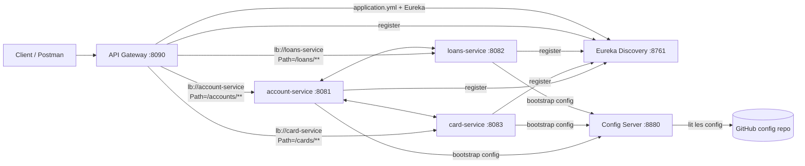

# Solution technique — TP Architecture Microservices

## 1. Vue d’ensemble de l’architecture

### 1.1 Schéma (Mermaid)



### 1.2 Rôle des composants

- **Discovery Service (Eureka)**
  - Annuaire de services.
  - Chaque microservice s’enregistre et envoie des *heartbeats*.
  - La Gateway et les clients internes peuvent retrouver dynamiquement les instances.

- **API Gateway (Spring Cloud Gateway)**
  - Point d’entrée unique.
  - Fait le routage HTTP vers les services métier.
  - Utilise `lb://<service-name>` pour résoudre l’URL via Eureka (routage dynamique + load-balancing).

- **Config Server**
  - Centralise la configuration.
  - Les services `account-service`, `card-service`, `loans-service` sont configurés pour récupérer leur configuration au démarrage via `bootstrap.yml`.

- **Services métier**
  - `account-service`: CRUD Account + endpoint de “détails” (Account + cards + loans).
  - `card-service`: CRUD Card + contrainte métier: création d’une Card uniquement si l’Account existe.
  - `loans-service`: CRUD Loan + contrainte métier: création d’un Loan uniquement si l’Account existe.

### 1.3 Ports & noms d’applications (observés dans le projet)

- **Eureka**: `8761`
- **Config Server**: `8880`
- **API Gateway**: `8090` (cf. `api-gateway/src/main/resources/application.yml`)
- **Services**: ports fournis par le Config Server (log vu côté `loans-service`: `8082`).

## 2. Journal des modifications & implémentation

### 2.1 Exigences du TP (rappel)

D’après `tp/tp micro.md`:
- Vérifier l’existence d’un `Account` avant de créer une `Card` ou un `Loan`.
- Récupérer un `Account` avec la liste de ses `Cards` et `Loans`.
- Intégrer un **DTO** dans le microservice `Account`.
- Externaliser les appels inter-services dans des **classes dédiées** utilisant `RestTemplate`.

### 2.2 Fichiers créés

#### account-service
- `src/main/java/org/example/accountservice/dto/AccountDto.java`
- `src/main/java/org/example/accountservice/dto/CardDto.java`
- `src/main/java/org/example/accountservice/dto/LoanDto.java`
- `src/main/java/org/example/accountservice/client/CardClient.java`
- `src/main/java/org/example/accountservice/client/LoanClient.java`
- `src/main/java/org/example/accountservice/config/RestTemplateConfig.java`

#### card-service
- `src/main/java/org/example/cardservice/client/AccountClient.java`
- `src/main/java/org/example/cardservice/config/RestTemplateConfig.java`

#### loans-service
- `src/main/java/org/example/loansservice/client/AccountClient.java`
- `src/main/java/org/example/loansservice/config/RestTemplateConfig.java`

### 2.3 Fichiers modifiés

#### account-service
- `src/main/java/org/example/accountservice/service/AccountService.java`
  - Ajout de `getAccountWithCardsAndLoans(Long id)`.
- `src/main/java/org/example/accountservice/service/impl/AccountServiceImpl.java`
  - Appels vers `card-service` et `loans-service` via clients RestTemplate.
  - Construction du `AccountDto`.
- `src/main/java/org/example/accountservice/controller/AccountController.java`
  - Ajout de l’endpoint `GET /accounts/{id}/details`.
- `pom.xml`
  - Ajout d’une dépendance `spring-boot-starter-webflux` (utilisée ici comme “client HTTP” disponible, même si `RestTemplate` vient déjà de `spring-boot-starter-web`).

#### card-service
- `src/main/java/org/example/cardservice/service/impl/CardServiceImpl.java`
  - Validation de l’existence du compte avant `saveCard`.
- `pom.xml`
  - Ajout `spring-boot-starter-webflux`.

#### loans-service
- `src/main/java/org/example/loansservice/service/impl/LoanServiceImpl.java`
  - Validation de l’existence du compte avant `saveLoan`.
- `pom.xml`
  - Ajout `spring-boot-starter-webflux`.

### 2.4 Dépendances critiques (et pourquoi)

- **`spring-cloud-starter-netflix-eureka-client`**
  - Permet l’enregistrement des services auprès d’Eureka.

- **`spring-cloud-starter-config` + `spring-cloud-starter-bootstrap`**
  - Permet de charger la config via Config Server dès la phase bootstrap.
  - Exemples (dans les services métier):

```yaml
# account-service/src/main/resources/bootstrap.yml
spring:
  application:
    name: account-service
  cloud:
    config:
      uri: http://localhost:8880
```

- **`RestTemplate` (Spring Web)**
  - Utilisé pour des appels synchrones simples inter-microservices.
  - On a volontairement isolé ces appels dans des classes `*Client`.

> Note mentor: dans Spring Boot 3, `RestTemplate` reste utilisable, mais Spring recommande souvent `WebClient` (réactif). Ici le TP demande explicitement `RestTemplate`.

### 2.5 Choix de configuration (ports, noms)

- Les noms `spring.application.name` sont **critiques**:
  - Ils doivent matcher les IDs `lb://...` de la Gateway.
  - Ils servent de clé pour la config distante (ex: `loans-service.yml` sur le repo Git du Config Server).

Extrait Gateway:

```yaml
# api-gateway/src/main/resources/application.yml
spring:
  cloud:
    gateway:
      routes:
        - id: account-service
          uri: lb://account-service
          predicates:
            - Path=/accounts/**
```

## 3. Analyse des concepts clés (mode mentor)

### 3.1 Routage dynamique (Gateway + `lb://`)

**Objectif**: éviter des URLs codées en dur (`http://localhost:8081`) et permettre:
- changement de port sans modifier la Gateway,
- plusieurs instances (scaling horizontal).

**Comment**:
- La route `uri: lb://account-service` dit à la Gateway:
  1. interroger Eureka pour obtenir la liste des instances `account-service` disponibles,
  2. choisir une instance (load-balancing),
  3. forwarder la requête.

**Pourquoi c’est important**:
- En microservices, les instances changent (redeploy, scaling). `lb://` + discovery évite la configuration “fragile”.

### 3.2 Service Discovery (cycle de vie)

- **Enregistrement**
  - Au démarrage, un service (ex: `loans-service`) se déclare auprès d’Eureka (`defaultZone`).

- **Heartbeat**
  - Périodiquement, le service “prouve” qu’il est vivant.
  - Si Eureka ne reçoit plus de heartbeat, il finit par retirer l’instance.

- **Consultation de l’annuaire**
  - La Gateway consulte Eureka pour trouver où router.
  - Un service peut aussi consulter Eureka (via `DiscoveryClient`) pour trouver un autre service.

Exemple projet (client interne) — `AccountClient` (card-service):

```java
ServiceInstance instance = discoveryClient.getInstances("account-service").get(0);
String url = instance.getUri().toString() + "/accounts/" + accountId;
restTemplate.getForObject(url, Object.class);
```

> Note mentor: on utilise ici `get(0)` pour simplifier. En production, on laisserait plutôt le load-balancer gérer la sélection d’instance, ou on ajouterait une stratégie de sélection/retentative.

### 3.3 Gestion des erreurs (focus: ports)

#### Pourquoi “Port already in use” arrive ?
- Un ancien processus (Java) tourne encore.
- Un autre service utilise le même port.

#### Comment diagnostiquer (macOS)
- Identifier le PID qui occupe un port:

```bash
lsof -i :8082
```

- Arrêter le processus:

```bash
kill -9 <PID>
```

> Pourquoi `lsof` ? Parce que c’est l’outil le plus direct pour relier “un port” → “un process” quand Spring dit seulement “Address already in use”.

## 4. Checklist de tests Postman

### 4.1 Hypothèses de test

- Eureka: `http://localhost:8761`
- Gateway: `http://localhost:8090`
- Ports directs (observés / usuels dans ce projet):
  - account-service: `8081`
  - loans-service: `8082`
  - card-service: `8083`

### 4.2 Checklist (via Gateway)

| Micro-service | Endpoint (via Gateway) | Méthode | Payload (JSON) | Statut attendu |
| :--- | :--- | :--- | :--- | :--- |
| Account | `http://localhost:8090/accounts` | POST | `{ "name":"Alice", "email":"alice@mail.com", "solde":1000 }` | 200 OK |
| Account | `http://localhost:8090/accounts` | GET | N/A | 200 OK |
| Account | `http://localhost:8090/accounts/{id}` | GET | N/A | 200 OK |
| Card | `http://localhost:8090/cards` | POST | `{ "cardNumber":"1111", "cardType":"VISA", "accountId":1 }` | 200 OK (si account existe) |
| Card | `http://localhost:8090/cards` | POST | `{ "cardNumber":"2222", "cardType":"VISA", "accountId":999 }` | 500 (RuntimeException) |
| Loan | `http://localhost:8090/loans` | POST | `{ "amount":5000, "type":"CAR", "accountId":1 }` | 200 OK (si account existe) |
| Loan | `http://localhost:8090/loans` | POST | `{ "amount":5000, "type":"CAR", "accountId":999 }` | 500 (RuntimeException) |
| Account (DTO) | `http://localhost:8090/accounts/{id}/details` | GET | N/A | 200 OK (avec `cards` + `loans`) |
| Card | `http://localhost:8090/cards/accounts/{accountId}` | GET | N/A | 200 OK |
| Loan | `http://localhost:8090/loans/accounts/{accountId}` | GET | N/A | 200 OK |

> Note mentor: le TP ne demande pas explicitement une gestion d’erreur HTTP “propre” (400/404). Ici, les erreurs sont des `RuntimeException` → généralement HTTP 500.

### 4.3 Tests directs (sans Gateway) — pour isoler un problème de routage

| Micro-service | Endpoint direct | Méthode | Payload (JSON) | Statut attendu |
| :--- | :--- | :--- | :--- | :--- |
| Account | `http://localhost:8081/accounts` | GET | N/A | 200 OK |
| Account | `http://localhost:8081/accounts/{id}/details` | GET | N/A | 200 OK |
| Card | `http://localhost:8083/cards/accounts/{accountId}` | GET | N/A | 200 OK |
| Loan | `http://localhost:8082/loans/accounts/{accountId}` | GET | N/A | 200 OK |

**Interprétation**:
- Si le direct marche mais pas via Gateway → problème de route Gateway / Eureka.
- Si rien ne marche → service down / port / config.

## 5. Guide de troubleshooting

### 5.1 `404 Not Found`

**Causes fréquentes**:
- Mauvais mapping Spring (`@RequestMapping`, `@GetMapping`, etc.).
- Mauvaise route Gateway (predicate `Path` incorrect).
- Appel d’un endpoint qui n’existe pas dans le service.

**Checklist**:
- Vérifier l’endpoint côté service:
  - Ex: `AccountController` expose bien `@GetMapping("/{id}/details")`.
- Vérifier la route Gateway:
  - `/accounts/**` doit bien router vers `lb://account-service`.
- Tester en direct:
  - `http://localhost:8081/accounts/1/details`

### 5.2 `Port already in use`

**Symptôme**: Spring refuse de démarrer, “Address already in use”.

**Résolution**:
- Trouver le processus:

```bash
lsof -i :8090
lsof -i :8081
lsof -i :8082
lsof -i :8083
lsof -i :8761
lsof -i :8880
```

- Stopper le process fautif:

```bash
kill -9 <PID>
```

### 5.3 Erreurs de *wiring* Spring (beans introuvables)

**Exemple réel rencontré**:
- `RestTemplate` non trouvé au démarrage de `loans-service`.

**Pourquoi**:
- La classe de configuration `RestTemplateConfig` n’était pas dans un package scanné par `@SpringBootApplication`.

**Comment éviter**:
- Garder les packages cohérents sous `org.example.<service-name>...`
- Mettre `config/`, `client/`, `controller/` sous la racine du package de l’application.

## Conclusion

La solution implémente les exigences du TP en respectant une architecture microservices classique:
- **routage dynamique** via Gateway (`lb://`) + Eureka,
- **validation métier** (Account obligatoire) dans `card-service` et `loans-service`,
- **composition de données** côté `account-service` via DTO (`AccountDto` + listes `cards`/`loans`),
- **clients RestTemplate dédiés** pour garder le code métier propre et testable.
